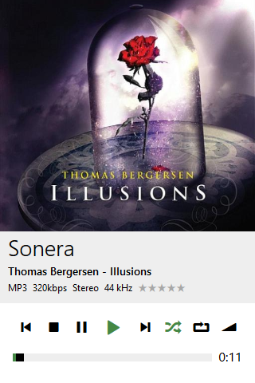
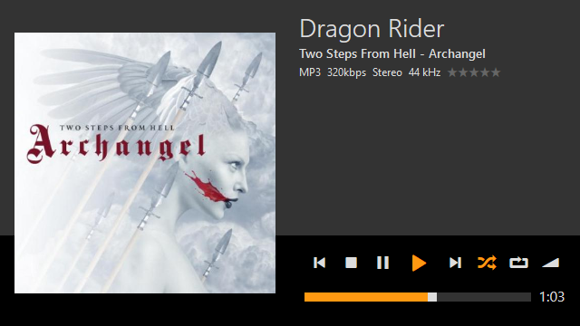
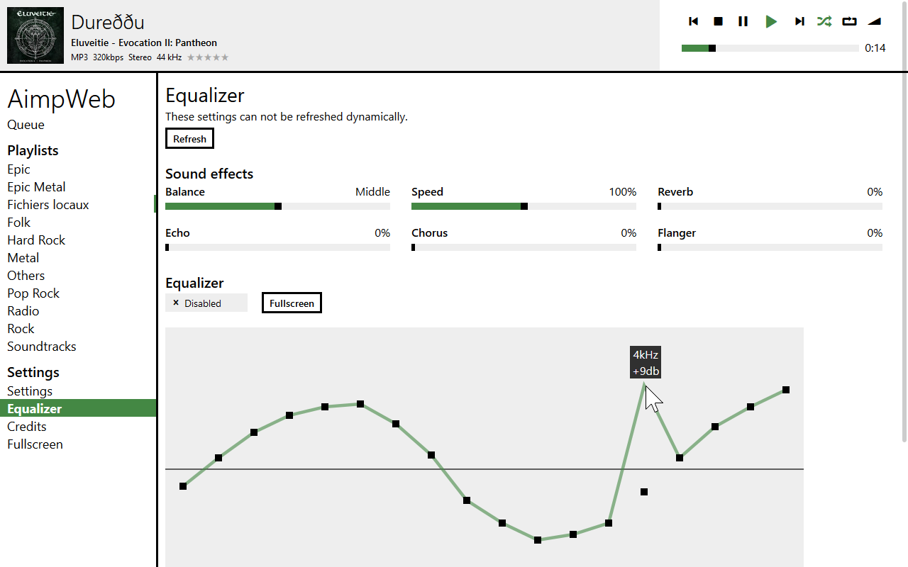

AimpWeb
=======

Introduction
------------
AimpWeb is an alternative interface for the [AIMP control plugin](https://github.com/a0ivanov/aimp-control-plugin).

Features:
- Translations in about 50 languages, including some RTL languages
- Color skins
- A more modern interface inspired by the 2015's Music app of Windows 8
- Sortable and filterable playlists
- Web notification
- Equalizer and support for some effects
- Queue handling
- A full-featured responsive mobile interface

How to install
--------------
1. Install the [AIMP control plugin](https://github.com/a0ivanov/aimp-control-plugin)
2. Open the Control Plugin Webscript folder (usually `%AppData%\AIMP\Control Plugin\htdocs`), replace everything in it by the content of this repository (if you want to restore the original interface later, backup the files first)
3. Launch AIMP
4. You can now access the web interface at `http://localhost:3333/` (this can be changed in the Control Plugin settings)

To access the application from another computer on the network, refer to the Control Plugin documentation.

About this project
------------------
This project is already several years old and hasn't be touched very much since then. The code is written in pure Javascript, using JQuery, Underscore and a [JSON/XML-RPC Client](https://code.google.com/archive/p/json-xml-rpc/) library. It uses the [Entypo](http://www.entypo.com) icon set.

The translations have been realized automatically using AIMP's language files and the old Bing Translator v1 API. They can be found in the *js/i18n* folder. To edit translations, edit the `.raw.js` files and then run the `autolang.php`. You will be prompted for missing translations as the old Bing Translator API has been disabled. Don't hesitate to send me corrected translations.

The application works pretty well but may sometimes lose the connexion to AIMP, especially on mobile devices. If that happens, just refresh the page. To move items in the queue, either use the handles on the left to drag and drop or just click on them.

Screenshots
-----------

 
 
 

